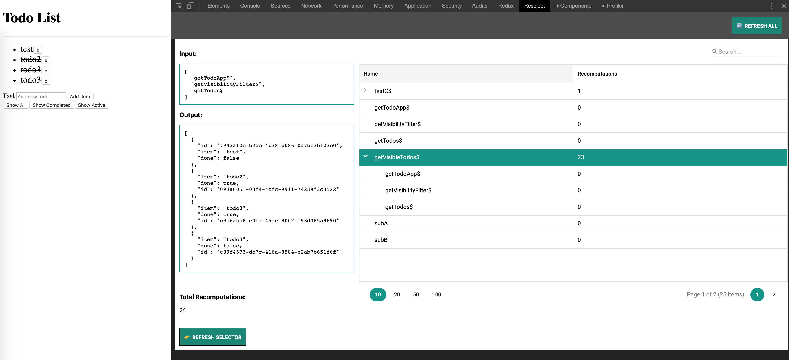

# Reselect Tools

Tools for working with the [reselect](https://github.com/reactjs/reselect) library:
*Check selector dependencies, inputs, outputs, and recomputations at any time!*




## Getting Started


1. Install the Package

        npm install -s reselect-tools
        
2. (Optional) Create a file `reselect.config.json` in your project root directory (recommended).

    ```json
    {
      "out": "src/redux/selectorIndex.ts",
      "src": [
        "src/**/*.ts",
        "src/**/*.tsx",
        "!src/**/*.test.ts"
      ],
      "tsConfigPath": "./tsconfig.json"
    }
    ```
    
    `out`: Where the index file will be created
    
    `src`: Array of locations to scan or exclude using `!` operator
    
    `tsConfigPath`: location of your typescript config file
    
    WARNING: Work only with Typescript projects. Next releases will provide a more generic parser also for .js files.

3. Run in your Terminal: `reselect-tools`

4. Configure the library in your project following these steps: 

    1. for your convenience use your configureStore file: 
    
    Example: 
    
    ```typescript
   
       import {createStore, applyMiddleware, combineReducers} from 'redux';
       
       import toDoApp from './modules/toDoApp';
       import {composeWithDevTools} from "redux-devtools-extension";
       
       // IMPORT YOUR INDEX AND RESELECT-TOOLS
       import * as selectors from './selectorIndex';   
       import * as ReselectTools from 'reselect-tools'
       
       const reducer = combineReducers({
           toDoApp
       });
       
       const store = createStore(reducer, composeWithDevTools(
           applyMiddleware(),
       ));
       
       
       // USE .getStateWith() method in order to get the current state
       // which will be used internally.
   
       ReselectTools.getStateWith(() => store.getState());
       
       // USE .registerSelectors() method passing your generated selectors index
       ReselectTools.registerSelectors(selectors);
       
       
   
       ...
   
   
       export default configureStore;
   
    ```

5. Install the Chrome Extension using this folder:
 `packages/reselect-tool-extension/build`.

6. Collaborate!


### Without The Extension

If you're using an unsupported browser, or aren't happy with the extension, you can still get at the data.

The dev tools bind to your app via this global:
```
  window.__RESELECT_TOOLS__
```

### Next Releases

Next releases will include:

1) Improved DEV experience using a Reselect Library Wrapper in order to automatically register our selectors without adding 
extra code in your project.
2) Listen all the selector changes using Observables
3) Add Selectors Javascript Code and file paths in the details column
4) Improved UI with a new and useful graph representation. 
5) Firefox Extension or Electron App.


## License

MIT